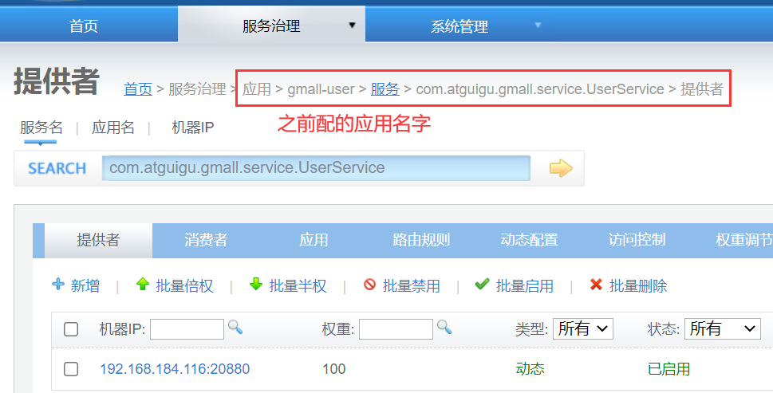
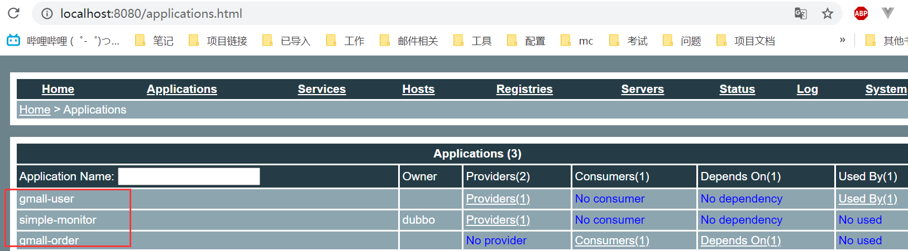
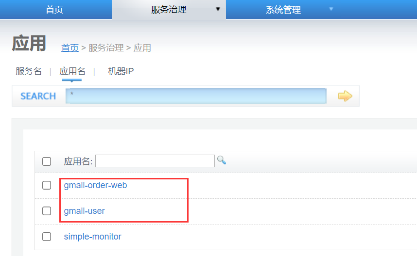
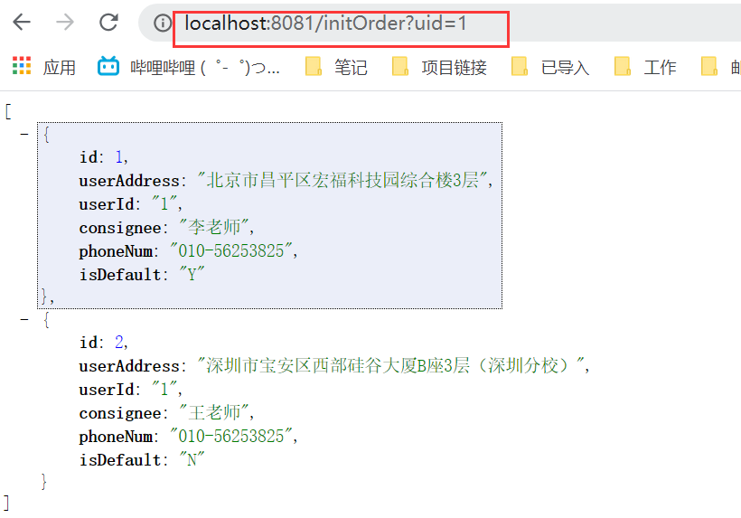
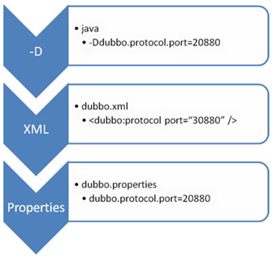
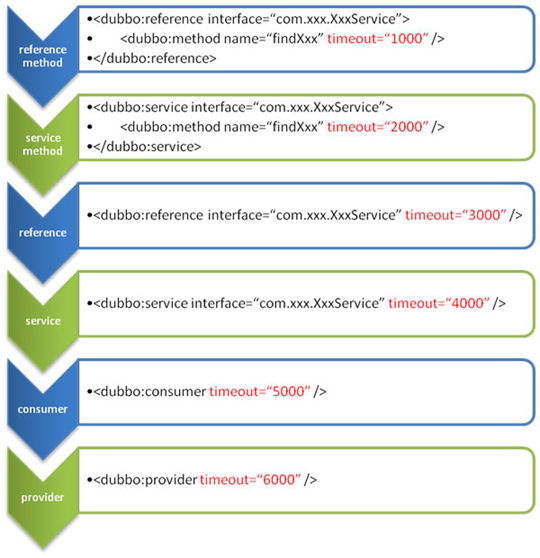
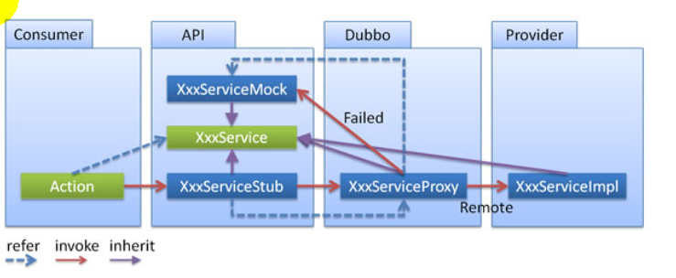
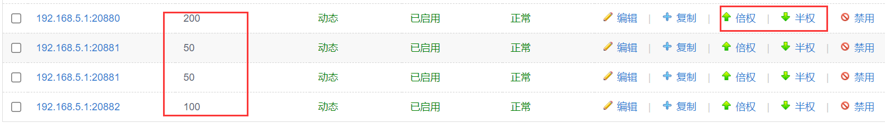

# 尚硅谷dubbo学习笔记

需求：
某个电商系统，订单服务(消费者)需要调用用户服务(生产者)获取某个用户的所有地址

我们现在 需要创建两个服务模块进行测试 
模块	                功能
订单服务web模块	    创建订单等
用户服务service模块	查询用户地址等

测试预期结果：订单服务web模块在A服务器，用户服务模块在B服务器，A可以远程调用B的功能。

## dubbo-admin是图形化的服务管理页面

用户服务(生产者)启动成功后可以看到zookeeper注册中心出现了一个应用服务提供者



启动消费者订单服务，调用接口成功


## dubbo-monitor-simple简单的监控中心

所有服务配置连接监控中心，进行监控统计，监控服务调用信息   


## 整合springboot
配置都可以转移到properties中了，依赖也全整合到com.alibaba.boot.dubbo-spring-boot-starter
新增了两个注解用来替代之前的配置，@Service、@Reference
@Service：用在provider中暴露服务。
@Reference：在customer中引用暴露的服务。

其实和之前的差不多

加上之前的监控中心变成了3个应用

消费者调用接口


## 配置原则



JVM 启动 -D 参数优先(-Ddubbo.protocol.port=20880)，这样可以使用户在部署和启动时进行参数重写，比如在启动时需改变协议的端口。
XML (和springboot整合过就是application.properties)次之，如果在 XML 中有配置，则 dubbo.properties 中的相应配置项无效。
dubbo.properties 最后，相当于缺省值，只有 XML 没有配置时，dubbo.properties 的相应配置项才会生效，通常用于共享公共配置，比如应用名。

## 启动时检查

Dubbo缺省会在**启动时检查依赖的服务是否可用，不可用时会抛出异常**，阻止Spring初始化完成，以便上线时，能及早发现问题，**默认check="true“**。可以通过check="false”关闭检查，比如，测试时，有些服务不关心，或者出现了循环依赖，必须有一方先启动。另外，如果你的Spring容器是懒加载的，或者通过API编程延迟引用服务，请关闭check，否则服务临时不可用时，会抛出异常，拿到null引用，如果check= "false"”，总是会返回引用，当服务恢复时，能自动连上。

## 超时时间配置规则
由于网络或服务端不可靠，会导致调用出现一种不确定的中间状态（超时）。为了避免超时导致客户端资源（线程）挂起耗尽，必须设置超时时间。


1）精确优先（方法级优先，接口级次之，全局配置再次之)<br/>
2）消费者设置优先(如果级别一样，则消费方优先，提供方次之)

## 重试次数配置

失败自动切换，当出现失败，重试其它服务器，但重试会带来更长延迟。可通过 retries="2" 来设置重试次数(不含第一次)。

```xml
<-- 
    retries= "":重试次数，不包含第一次调用
	幂等（设置重试次数）【查询、删除、修改】、非幂等（不能设置重试次数）【新增】
    如果新增方法有延迟会导致数据被添加多次，而删改查方法是针对某个id的，不会被重试影响
-->
<dubbo:service  retries="2" />  或 
<dubbo:reference  retries="2" />  或  
<dubbo:reference>    
    <dubbo:method name="findFoo"  retries="2" />  
</dubbo:reference>  

```

## 多版本号

当一个接口实现，出现不兼容升级时，可以用版本号过渡，版本号不同的服务相互间不引用。
可以按照以下的步骤进行版本迁移：
在低压力时间段，先升级一半提供者为新版本
再将所有消费者升级为新版本
然后将剩下的一半提供者升级为新版本

```xml
老版本服务提供者配置：  
<dubbo:service interface="com.foo.BarService"  version="1.0.0" />   
新版本服务提供者配置： 
<dubbo:service  interface="com.foo.BarService" version="2.0.0" />   
老版本服务消费者配置：  
<dubbo:reference  id="barService" interface="com.foo.BarService"  version="1.0.0" />     
新版本服务消费者配置：  
<dubbo:reference  id="barService" interface="com.foo.BarService"  version="2.0.0" />     
如果不需要区分版本，可以按照以下的方式配置：  
<dubbo:reference  id="barService" interface="com.foo.BarService"  version="*" />  
```
当改成*号时，两个版本会随机被调用，这样可以实现灰度发布

## 本地存根

远程服务后，客户端通常只剩下接口，而实现全在服务器端，但提供方有些时候想在客户端也执行部分逻辑，比如:做ThreadLocal缓存，提前验证参数，调用失败后伪造容错数据等等，此时就需要在API中带上Stub，客户端生成Proxy 实例，会把Proxy通过构造函数传给Stub1，然后把 Stub暴露给用户，Stub 可以决定要不要去调Proxy。


## 整合springboot的第二种方法

导入dubbo-starter，使用@ImportResource导入dubbo的配置文件即可@ImportResource(locations="classpath:provider.xml")。
复制一份之前的xml，注释app.pro里的配置和service注解即可

## 整合springboot的第三种方法

要重新用注解暴露服务，添加配置类，将每一个组件手动创建到容器中,让dubbo来扫描其他的组件
@EnableDubbo(scanBasePackages="com.atguigu.gmall")


# dubbo高可用

## 1、zookeeper宕机与dubbo直连

现象：zookeeper注册中心宕机，还可以消费dubbo暴露的服务。

原因：健壮性

1.监控中心宕掉不影响使用，只是丢失部分采样数据
2.数据库宕掉后，注册中心仍能通过缓存提供服务列表查询，但不能注册新服务
3.注册中心对等集群，任意一台宕掉后，将自动切换到另一台
4.注册中心全部宕掉后，服务提供者和服务消费者仍能通过**本地缓存通讯**
5.服务提供者无状态，任意一台宕掉后，不影响使用
6.服务提供者全部宕掉后，服务消费者应用将无法使用，并无限次重连等待服务提供者恢复

高可用：通过设计，减少系统不能提供服务的时间；

dubbo直连方式@Reference(url = "127.0.0.1:20882")

## 集群下dubbo负载均衡配置

在集群负载均衡时，Dubbo 提供了多种均衡策略，**缺省为 random 随机调用**。

负载均衡策略

**Random LoadBalance**
随机，按权重设置随机概率。
在一个截面上碰撞的概率高，但调用量越大分布越均匀，而且按概率使用权重后也比较均匀，有利于动态调整提供者权重。

**RoundRobin LoadBalance**
轮循，按公约后的权重设置轮循比率。
存在慢的提供者累积请求的问题，比如：第二台机器很慢，但没挂，当请求调到第二台时就卡在那，久而久之，所有请求都卡在调到第二台上。

**LeastActive LoadBalance**
最少活跃调用数，相同活跃数的随机，活跃数指调用前后计数差。
使慢的提供者收到更少请求，因为越慢的提供者的调用前后计数差会越大。

**ConsistentHash LoadBalance**
一致性 Hash，相同参数的请求总是发到同一提供者。
当某一台提供者挂时，原本发往该提供者的请求，基于虚拟节点，平摊到其它提供者，不会引起剧烈变动。算法参见：http://en.wikipedia.org/wiki/Consistent_hashing
缺省只对第一个参数 Hash，如果要修改，请配置 <dubbo:parameter key="hash.arguments" value="0,1" />
缺省用 160 份虚拟节点，如果要修改，请配置 <dubbo:parameter key="hash.nodes" value="320" />
