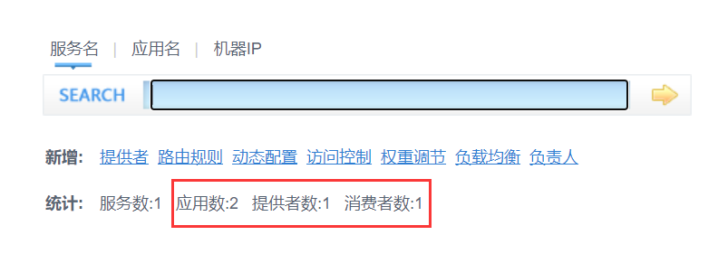
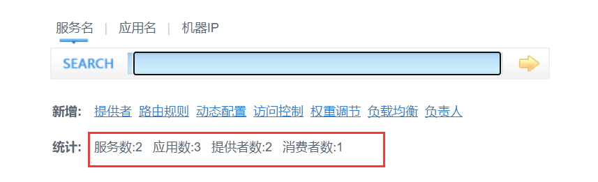

尚硅谷dubbo学习笔记

需求：
某个电商系统，订单服务(消费者)需要调用用户服务(生产者)获取某个用户的所有地址

我们现在 需要创建两个服务模块进行测试 
模块	                功能
订单服务web模块	    创建订单等
用户服务service模块	查询用户地址等

测试预期结果：订单服务web模块在A服务器，用户服务模块在B服务器，A可以远程调用B的功能。

dubbo-admin是图形化的服务管理页面

用户服务(生产者)启动成功后可以看到zookeeper注册中心出现了一个应用服务提供者

启动消费者订单服务，调用接口成功

dubbo-monitor-simple简单的监控中心

所有服务配置连接监控中心，进行监控统计，监控服务调用信息   

整合springboot
配置都可以转移到properties中了，依赖也全整合到com.alibaba.boot.dubbo-spring-boot-starter
新增了两个注解用来替代之前的配置，@Service、@Reference
@Service：用在provider中暴露服务。
@Reference：在customer中引用暴露的服务。

其实和之前的差不多

加上之前的监控中心变成了3个应用

消费者调用接口

配置原则

JVM 启动 -D 参数优先(-Ddubbo.protocol.port=20880)，这样可以使用户在部署和启动时进行参数重写，比如在启动时需改变协议的端口。
XML (和springboot整合过就是application.properties)次之，如果在 XML 中有配置，则 dubbo.properties 中的相应配置项无效。
dubbo.properties 最后，相当于缺省值，只有 XML 没有配置时，dubbo.properties 的相应配置项才会生效，通常用于共享公共配置，比如应用名。

